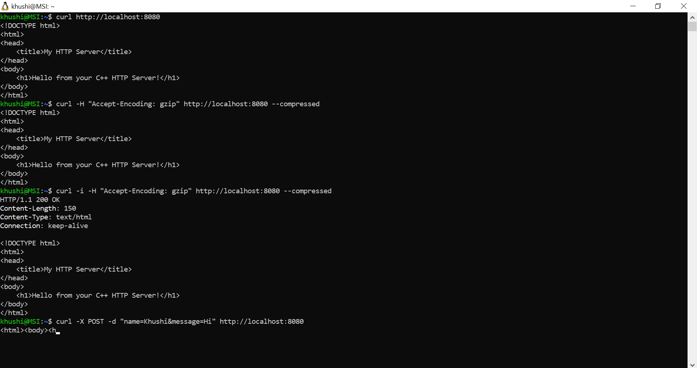
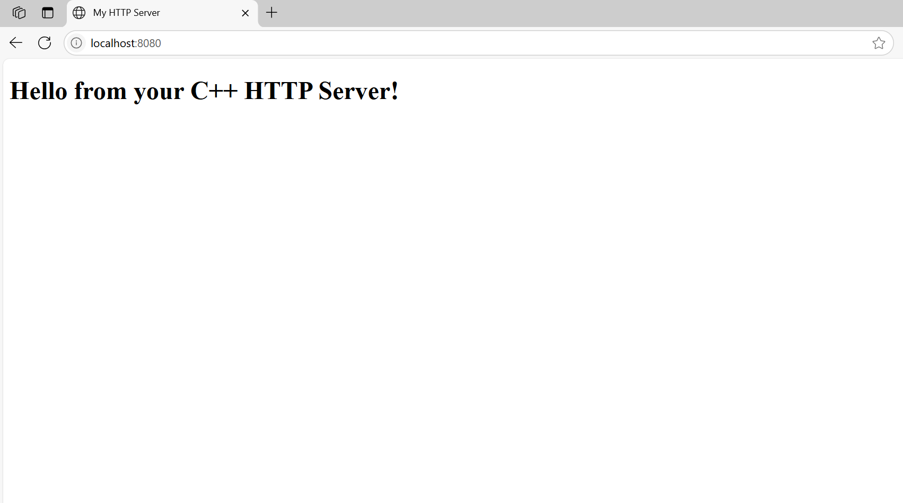

# C++ HTTP Server 🚀

A multithreaded, persistent HTTP server built from scratch in C++ using low-level Linux sockets.  
This project demonstrates how core web server features work — including file serving, request parsing, threading, compression, and persistent connections.


## ✨ Features

 ✅ Handles basic **GET** and **POST** requests  
 ✅ Extracts headers and request body  
 ✅ Serves **static HTML files**  
 ✅ Supports **GZIP compression** if client requests it  
 ✅ Maintains **persistent (keep-alive)** connections  
 ✅ Handles **multiple concurrent clients** using threads  
 ✅ Fully compatible with **Linux** and **WSL on Windows**


 ## 📸 Screenshots

### 🖥️ Server Running in Terminal



### 🌐 Web Page in Browser




## 🛠️ Prerequisites

Make sure your environment has:

- C++ compiler (e.g., `g++`)
- `make`
- `zlib` development library

### Install on Ubuntu/WSL

```bash
sudo apt update
sudo apt install build-essential zlib1g-dev


🧱 Project Structure

http_server/
├── src/                  # Source code files
│   ├── main.cpp
│   ├── server.cpp
│   └── server.hpp
├── static/               # Static files served by the server
│   └── index.html
├── Makefile              # For building the server
└── .gitignore
🧪 Build Instructions
From the project root directory, run:
make
This will compile the source files and create an executable named server.

🚀 Run the Server
./server
You should see:

Listening on port 8080...
The server is now running at:
http://localhost:8080

🧪 Test the Server
You can test the server using a browser or the curl command.

✅ Test 1: Visit in Browser
Open your browser and go to:
http://localhost:8080
You should see the contents of static/index.html.

✅ Test 2: Basic GET Request (Open a different terminal and run these tests by keeping the previous one running)
curl http://localhost:8080
✅ Test 3: GZIP Compression (Simulated)
curl -H "Accept-Encoding: gzip" http://localhost:8080 --compressed
Add -i to see response headers.

✅ Test 4: POST Request
curl -X POST -d "name=Khushi&message=Hello" http://localhost:8080
You’ll receive an HTML response echoing the POST data.

✅ Test 5: 404 Not Found
curl http://localhost:8080/doesnotexist.html
Expected response: 404 Not Found

🧹 Clean Build Files
make clean
This will remove the compiled executable (server).

🙋‍♀️ Author
Khushi Gupta
GitHub: @Khushi0389